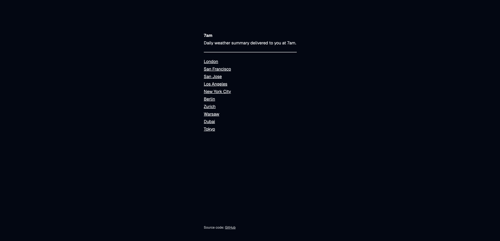

# 7am

[7am.is](https://7am.is)



7am is a website that delivers daily weather summary to the user at 7am.

It queries weather data from the [MET Norway API](https://developer.yr.no/), then uses Gemini-2.0-Flash to summarize the resulting response.
Finally, the summary is delivered to the user using the [web push API](https://developer.mozilla.org/en-US/docs/Web/API/Push_API).

## Deploying 7am

Before running 7am, create a `.env` file using the provided `.env.sample` file as a base template.
The sample file also contains documentation of what the variables are for.

### Docker

7am provides a `Dockerfile` that packages 7am into a Docker image that you can run.
You can choose to run the image as-is using `docker run`, or, you can also run it as part of a Docker Compose deployment.

- **Volume**: 7am stores runtime data in `/app/data` within the container. The binary itself sits in `/app`
- **Port**: 7am listens on port 8080 in the container.
- **Running user**: 7am is run as `nonroot` within the container. You can pass `gid` and `uid` as build args to override the default user and group id.

For Docker Compose users, a `docker-compose.yml` file is provided for reference.

If you encounter permission issues, make sure that the data directory on the host is writable by the running user and group.
For example, if user id and group id `1001:1001` owns the data directory on the host,
then the running user and group in the container need to have the same user id and group id.
Use `gid` and `uid` build args to override the IDs in the container accordingly.

### Building 7am

To compile 7am, you need to have Go 1.24 installed. Run:

```
go build -o ./server
```

to build 7am. A binary named `server` binary will be produced (you can choose to name it to something else.)
Upon initial start up, a directory called `data` will be created in the current working directory.
